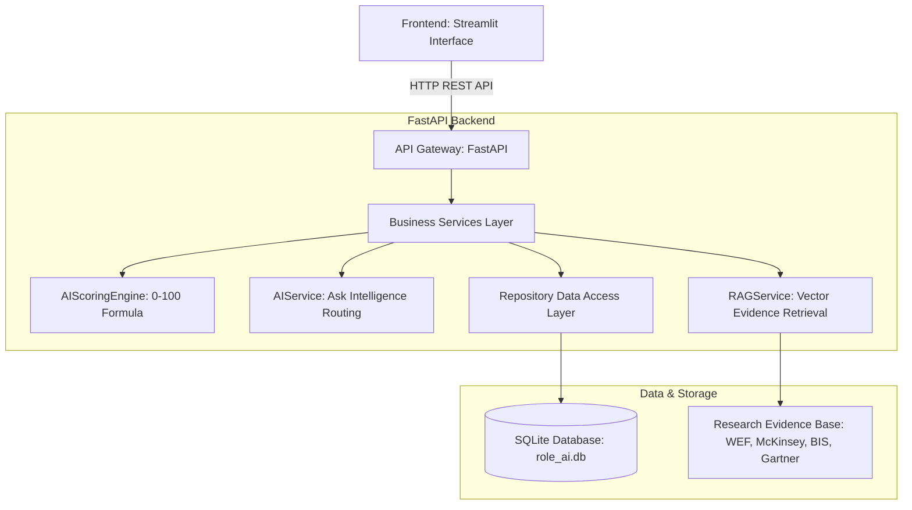
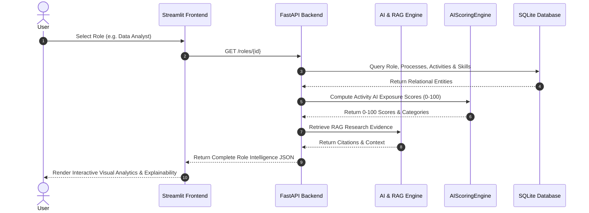

# System Architecture Documentation

## Overview

The **Role-Level AI Intelligence Platform** is a multi-layer enterprise system built for Banking and Financial Services. It analyzes how artificial intelligence impacts job roles across processes, activities, skills, AI exposure scores, future responsibilities, and research evidence.

---

## 🏗 System Architecture Diagram

---

## 🔄 Request & Data Flow Diagram

---

## 📦 Component Architecture

### 1. User Interface Layer (Streamlit)
- **Executive Dashboard**: High-level KPIs, top AI impacted roles chart, future skills distribution.
- **Role Explorer**: Search and inspect processes, activities, and skills across 20+ banking roles.
- **Comprehensive Role Analysis**: Deep 13-stage analysis view with activity breakdown, future profile, and evidence drawer.
- **Dynamic Role Comparison**: Side-by-side comparison of 2 roles with dynamically calculated differences.
- **AI Impact Ranking**: Top 5 and Top N role ranking by AI impact score.
- **Add New Role (Surprise Test)**: Form to enter new roles (e.g. Supply Chain Analyst) that dynamically calculates AI impact and persists to DB.
- **Ask Intelligence**: Natural language query engine backed by RAG evidence and deterministic DB routing.
- **Research Evidence Base**: Interactive directory of public research reports (McKinsey, WEF, BIS, Gartner, BLS).

### 2. API Gateway Layer (FastAPI)
- **`/roles`**: CRUD endpoints for listing, retrieving, and creating roles.
- **`/roles/{id}/analysis`**: AI impact score calculation and future profile retrieval.
- **`/roles/compare`**: Dynamic side-by-side role comparison.
- **`/analytics/top-ai-impact`**: Dynamic top-N AI impact ranking.
- **`/ask`**: Hybrid deterministic DB query + RAG natural language synthesis.
- **`/roles/new-role/create-and-analyze`**: Surprise test endpoint for dynamic role ingestion.

### 3. Business Logic Layer
- **`AIScoringEngine`**: Repeatable, explainable 0–100 scale scoring formula evaluating 7 activity dimensions.
- **`RAGService`**: Vector similarity retrieval over research sources and structured role context.
- **`AIService`**: Intelligent query routing and natural language answer synthesis.
- **`RoleCreationService`**: Dynamic role creation, scoring, evidence linkage, and database persistence.

### 4. Data Access & Persistence Layer (SQLAlchemy + SQLite)
- SQLite database (`backend/role_ai.db`) containing 13 relational tables storing roles, processes, activities, skills, relationships, AI impacts, future profiles, and research evidence.
