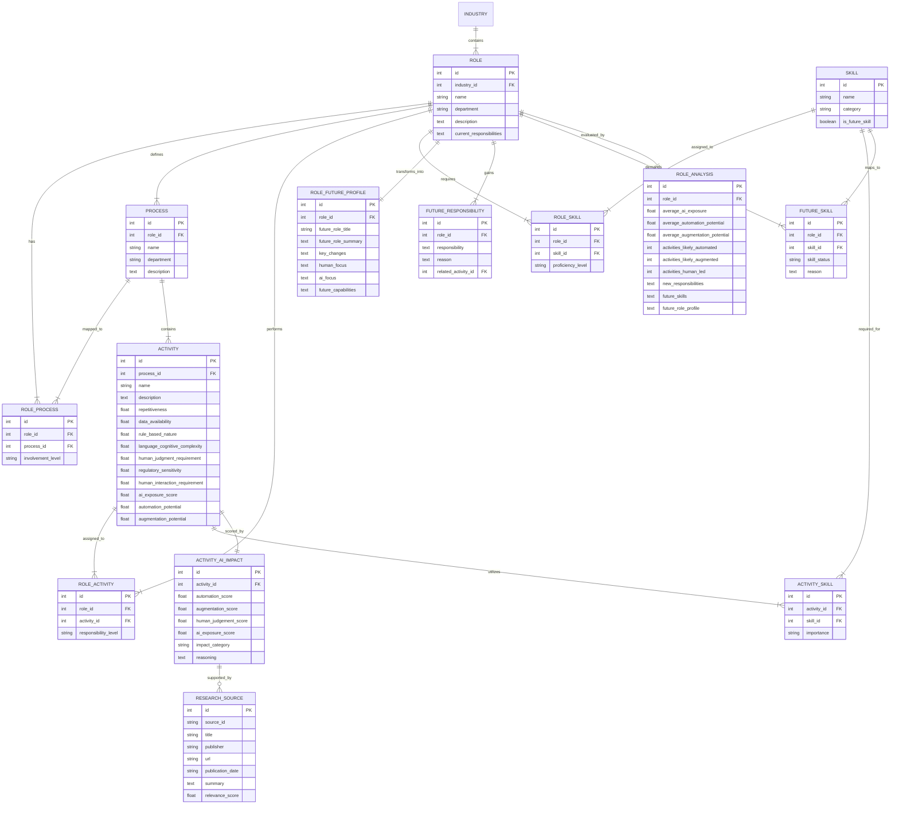

# Data Model Documentation

## Entity Relationship (ER) Diagram

---

## Table Descriptions

1. **`roles`**: Stores the 20+ banking roles, their descriptions, department, and baseline responsibilities.
2. **`processes`**: Stores banking processes (e.g., Data Management, Risk Assessment, Credit Underwriting).
3. **`activities`**: Stores specific granular activities with input characteristics and normalized scores.
4. **`skills`**: Reusable skills catalog (~60 skills across Technical, Domain, Analytics, and Soft categories).
5. **`role_processes`**: Association mapping connecting roles to processes with `involvement_level` (`Primary`, `Secondary`, `Supporting`).
6. **`role_activities`**: Association mapping connecting roles to activities with `responsibility_level` (`Primary`, `Supporting`, `Review`).
7. **`role_skills`**: Association mapping connecting roles to skills with `proficiency_level` (`Basic`, `Intermediate`, `Advanced`, `Expert`).
8. **`activity_skills`**: Association mapping connecting activities to skills with `importance` (`Low`, `Medium`, `High`).
9. **`activity_ai_impact`**: Detailed 0–100 scale activity AI impact assessment with qualitative reasoning.
10. **`future_responsibilities`**: New tasks emerging for each role due to AI adoption.
11. **`future_skills`**: Skill requirements for the future role with explicit status (`Emerging`, `Increasing`, `AI-Augmented`, `Changing`, `Declining`, `Enduring Human Capability`).
12. **`role_future_profiles`**: Transformed future role profile title, summary, human vs AI focus, and capabilities.
13. **`research_sources`**: Verified public research papers and industry benchmarks (WEF, McKinsey, BIS, Gartner, BLS).
14. **`role_analyses`**: Aggregated role-level AI exposure metrics and summary statistics.
